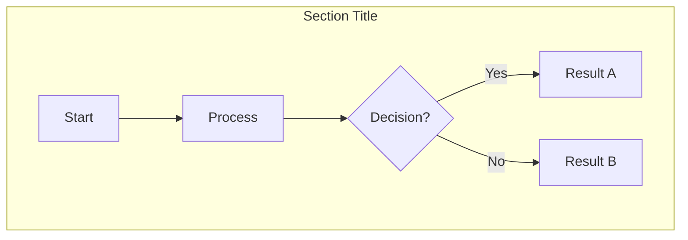
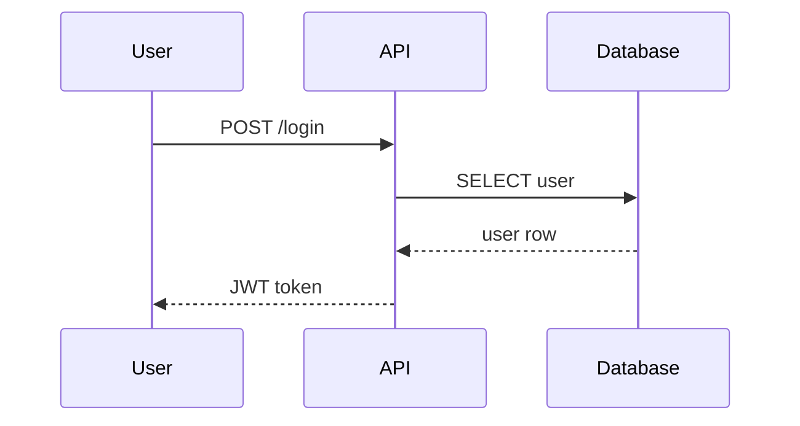
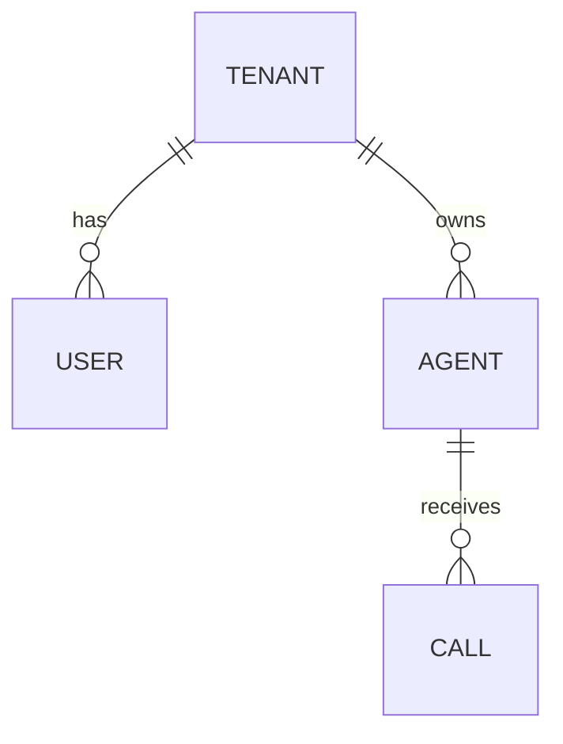
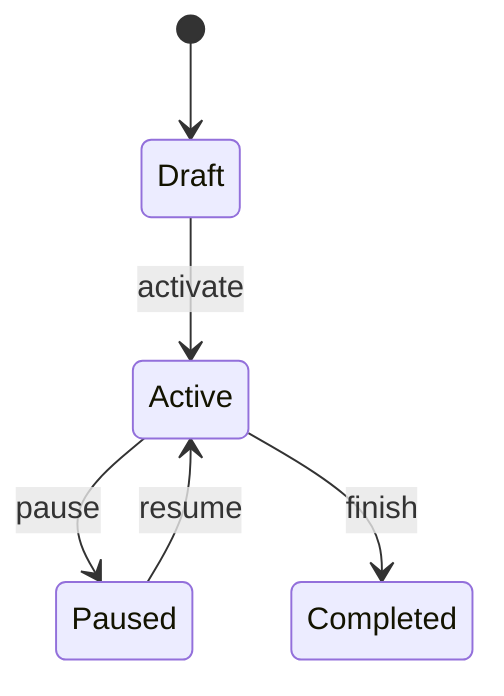
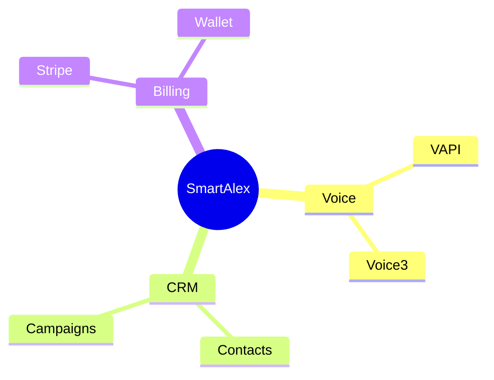

# Mermaid Diagram Skill

Create interactive, zoomable Mermaid diagrams as standalone HTML files. Every diagram is a full whiteboard experience — scroll to zoom, drag to pan, pinch on mobile, keyboard shortcuts, fit-to-screen.

## Workflow

### Step 1: Determine diagram details

Ask or infer:
- **Title**: Short descriptive title for the toolbar (e.g., "Partner Channel System", "Auth Flow")
- **Type**: Mermaid diagram type — `flowchart`, `sequenceDiagram`, `classDiagram`, `erDiagram`, `stateDiagram-v2`, `gantt`, `journey`, `mindmap`, `timeline`, `gitgraph`, `C4Context`, etc.
- **Save location**: Default to `docs/planning/assets/diagrams/` — use kebab-case filename

### Step 2: Build the Mermaid definition

Write valid Mermaid syntax. Follow these rules:

**Styling:**
- Use `classDef` for custom node colors — match Alex-CI palette:
  - Primary dark: `#010033` (navy)
  - Primary blue: `#1a56db`
  - Success green: `#059669`
  - Purple accent: `#7c3aed`
  - Warning amber: `#f59e0b`
  - Error red: `#ef4444`
  - Light backgrounds: `#dbeafe` (blue), `#d1fae5` (green), `#fef3c7` (amber), `#fee2e2` (red)
  - Neutral: `#f1f5f9` (slate-100), `#f3f4f6` (gray-100)
- Use `subgraph` to group related nodes into sections
- Use `direction TB` (top-bottom) or `direction LR` (left-right) as appropriate
- Use descriptive node labels with `<br/>` for multi-line text
- Use emojis sparingly for visual anchors on key nodes
- Dotted lines (`-.->`) for cross-layer/async connections, solid (`-->`) for direct flow

**Quality checklist:**
- Every node has a meaningful label (no single-letter IDs visible to user)
- Subgraphs have clear titles describing the section
- Color classes applied to distinguish node types (entry, action, success, data, etc.)
- No overlapping connections — keep the graph readable

### Step 3: Generate the HTML file

Use this exact template. Replace `{{TITLE}}` and `{{MERMAID_DEFINITION}}` with the actual content:

```html
<!DOCTYPE html>
<html lang="en">
<head>
<meta charset="UTF-8">
<meta name="viewport" content="width=device-width, initial-scale=1.0">
<title>{{TITLE}}</title>
<style>
  * { margin: 0; padding: 0; box-sizing: border-box; }
  body {
    font-family: 'DM Sans', -apple-system, BlinkMacSystemFont, sans-serif;
    background: #f8fafc;
    overflow: hidden;
    height: 100vh;
    width: 100vw;
  }
  #toolbar {
    position: fixed;
    top: 0;
    left: 0;
    right: 0;
    z-index: 100;
    background: #010033;
    color: #fff;
    display: flex;
    align-items: center;
    justify-content: space-between;
    padding: 10px 24px;
    gap: 16px;
    box-shadow: 0 2px 12px rgba(0,0,0,0.15);
  }
  #toolbar h1 {
    font-size: 15px;
    font-weight: 500;
    letter-spacing: -0.01em;
    white-space: nowrap;
    overflow: hidden;
    text-overflow: ellipsis;
  }
  #toolbar .controls {
    display: flex;
    align-items: center;
    gap: 8px;
    flex-shrink: 0;
  }
  #toolbar button {
    background: rgba(255,255,255,0.12);
    border: 1px solid rgba(255,255,255,0.2);
    color: #fff;
    padding: 6px 14px;
    border-radius: 6px;
    font-size: 13px;
    font-weight: 500;
    cursor: pointer;
    transition: background 0.15s;
    font-family: inherit;
  }
  #toolbar button:hover { background: rgba(255,255,255,0.22); }
  #toolbar button:active { transform: scale(0.97); }
  #toolbar .zoom-display {
    font-size: 13px;
    opacity: 0.7;
    min-width: 50px;
    text-align: center;
  }
  #toolbar .hint {
    font-size: 12px;
    opacity: 0.5;
  }
  #canvas {
    position: absolute;
    top: 48px;
    left: 0;
    right: 0;
    bottom: 0;
    overflow: hidden;
    cursor: grab;
  }
  #canvas:active { cursor: grabbing; }
  #diagram-container {
    transform-origin: 0 0;
    position: absolute;
    padding: 60px;
  }
  .mermaid svg {
    max-width: none !important;
  }
</style>
</head>
<body>

<div id="toolbar">
  <h1>{{TITLE}}</h1>
  <div class="controls">
    <span class="hint">Scroll to zoom · Drag to pan · F to fit · 0 to reset</span>
    <button onclick="zoomIn()">+ Zoom In</button>
    <button onclick="zoomOut()">- Zoom Out</button>
    <span class="zoom-display" id="zoom-level">100%</span>
    <button onclick="resetView()">Reset</button>
    <button onclick="fitToScreen()">Fit</button>
  </div>
</div>

<div id="canvas">
  <div id="diagram-container">
    <div class="mermaid">
{{MERMAID_DEFINITION}}
    </div>
  </div>
</div>

<script type="module">
  import mermaid from 'https://cdn.jsdelivr.net/npm/mermaid@11/dist/mermaid.esm.min.mjs';

  mermaid.initialize({
    startOnLoad: true,
    theme: 'base',
    themeVariables: {
      primaryColor: '#dbeafe',
      primaryBorderColor: '#3b82f6',
      primaryTextColor: '#010033',
      lineColor: '#64748b',
      secondaryColor: '#f0fdf4',
      tertiaryColor: '#fef3c7',
      fontFamily: '-apple-system, BlinkMacSystemFont, DM Sans, sans-serif',
      fontSize: '14px',
    },
    flowchart: {
      htmlLabels: true,
      curve: 'basis',
      padding: 16,
      nodeSpacing: 40,
      rankSpacing: 50,
      useMaxWidth: false,
    },
    sequence: {
      useMaxWidth: false,
      mirrorActors: false,
      messageAlign: 'center',
    },
    er: {
      useMaxWidth: false,
    },
    gantt: {
      useMaxWidth: false,
    },
    securityLevel: 'loose',
  });

  // Wait for render then fit to screen
  setTimeout(() => fitToScreen(), 1000);
</script>

<script>
  // --- Zoom & Pan (whiteboard controls) ---
  const canvas = document.getElementById('canvas');
  const container = document.getElementById('diagram-container');
  let scale = 1;
  let translateX = 0;
  let translateY = 0;
  let isDragging = false;
  let startX, startY;

  function applyTransform() {
    container.style.transform = `translate(${translateX}px, ${translateY}px) scale(${scale})`;
    document.getElementById('zoom-level').textContent = Math.round(scale * 100) + '%';
  }

  // Scroll to zoom (toward mouse position)
  canvas.addEventListener('wheel', (e) => {
    e.preventDefault();
    const rect = canvas.getBoundingClientRect();
    const mouseX = e.clientX - rect.left;
    const mouseY = e.clientY - rect.top;
    const oldScale = scale;
    const delta = e.deltaY > 0 ? 0.9 : 1.1;
    scale = Math.min(Math.max(scale * delta, 0.05), 8);
    translateX = mouseX - (mouseX - translateX) * (scale / oldScale);
    translateY = mouseY - (mouseY - translateY) * (scale / oldScale);
    applyTransform();
  }, { passive: false });

  // Drag to pan
  canvas.addEventListener('mousedown', (e) => {
    isDragging = true;
    startX = e.clientX - translateX;
    startY = e.clientY - translateY;
  });
  canvas.addEventListener('mousemove', (e) => {
    if (!isDragging) return;
    translateX = e.clientX - startX;
    translateY = e.clientY - startY;
    applyTransform();
  });
  canvas.addEventListener('mouseup', () => isDragging = false);
  canvas.addEventListener('mouseleave', () => isDragging = false);

  // Touch support (single finger pan, pinch to zoom)
  let lastTouchDist = 0;
  canvas.addEventListener('touchstart', (e) => {
    if (e.touches.length === 1) {
      isDragging = true;
      startX = e.touches[0].clientX - translateX;
      startY = e.touches[0].clientY - translateY;
    }
    if (e.touches.length === 2) {
      lastTouchDist = Math.hypot(
        e.touches[0].clientX - e.touches[1].clientX,
        e.touches[0].clientY - e.touches[1].clientY
      );
    }
  }, { passive: false });
  canvas.addEventListener('touchmove', (e) => {
    e.preventDefault();
    if (e.touches.length === 1 && isDragging) {
      translateX = e.touches[0].clientX - startX;
      translateY = e.touches[0].clientY - startY;
      applyTransform();
    }
    if (e.touches.length === 2) {
      const dist = Math.hypot(
        e.touches[0].clientX - e.touches[1].clientX,
        e.touches[0].clientY - e.touches[1].clientY
      );
      scale = Math.min(Math.max(scale * (dist / lastTouchDist), 0.05), 8);
      lastTouchDist = dist;
      applyTransform();
    }
  }, { passive: false });
  canvas.addEventListener('touchend', () => isDragging = false);

  // Button controls
  window.zoomIn = () => { scale = Math.min(scale * 1.25, 8); applyTransform(); };
  window.zoomOut = () => { scale = Math.max(scale * 0.8, 0.05); applyTransform(); };
  window.resetView = () => { scale = 1; translateX = 0; translateY = 0; applyTransform(); };
  window.fitToScreen = () => {
    const svg = container.querySelector('svg');
    if (!svg) return;
    const svgRect = svg.getBoundingClientRect();
    const canvasRect = canvas.getBoundingClientRect();
    const scaleX = (canvasRect.width - 40) / (svgRect.width / scale);
    const scaleY = (canvasRect.height - 40) / (svgRect.height / scale);
    scale = Math.min(scaleX, scaleY, 1.5);
    translateX = (canvasRect.width - (svgRect.width / (svgRect.width / scale * scale))) / 2;
    translateY = 20;
    applyTransform();
  };

  // Keyboard shortcuts
  document.addEventListener('keydown', (e) => {
    if (e.key === '=' || e.key === '+') { e.preventDefault(); zoomIn(); }
    if (e.key === '-') { e.preventDefault(); zoomOut(); }
    if (e.key === '0') { e.preventDefault(); resetView(); }
    if (e.key === 'f' || e.key === 'F') { e.preventDefault(); fitToScreen(); }
  });
</script>

</body>
</html>
```

### Step 4: Save the file

Default save location: `docs/planning/assets/diagrams/{name}.html`

Use kebab-case for the filename (e.g., `partner-channel-system.html`, `auth-flow.html`, `database-schema.html`).

If the `docs/planning/assets/diagrams/` directory doesn't exist, create it.

### Step 5: Tell the user how to open it

After saving, tell the user:
```
open docs/planning/assets/diagrams/{name}.html
```

They can open it in any browser. It's a fully self-contained HTML file — no server needed.

## Diagram Type Examples

### Flowchart (most common)


### Sequence Diagram


### ER Diagram


### State Diagram


### Mindmap


## Style Guide

**Node shapes for meaning:**
- `["Label"]` — rectangle: standard process/step
- `("Label")` — rounded: start/end/status
- `{"Label"}` — diamond: decision point
- `[["Label"]]` — subroutine: external system
- `(["Label"])` — stadium: entry/exit point
- `[("Label")]` — cylinder: database/storage

**Connection types:**
- `-->` — solid arrow: direct flow
- `-.->` — dotted arrow: async/cross-boundary
- `==>` — thick arrow: critical path
- `--text-->` — labeled connection

**Color palette (classDef):**
```
classDef entryNode fill:#010033,stroke:#010033,color:#fff,font-weight:bold
classDef actionNode fill:#1a56db,stroke:#0f3a8e,color:#fff
classDef successNode fill:#059669,stroke:#047857,color:#fff,font-weight:bold
classDef warningNode fill:#f59e0b,stroke:#d97706,color:#fff
classDef errorNode fill:#ef4444,stroke:#dc2626,color:#fff
classDef purpleNode fill:#7c3aed,stroke:#6d28d9,color:#fff
classDef lightBlue fill:#dbeafe,stroke:#3b82f6,color:#1e40af
classDef lightGreen fill:#d1fae5,stroke:#10b981,color:#065f46
classDef lightAmber fill:#fef3c7,stroke:#f59e0b,color:#92400e
classDef lightRed fill:#fee2e2,stroke:#ef4444,color:#991b1b
classDef tableNode fill:#f1f5f9,stroke:#475569,color:#0f172a
classDef neutralNode fill:#f3f4f6,stroke:#9ca3af,color:#4b5563
```

## Important Rules

1. **ALWAYS output standalone HTML** — never raw `.md` with mermaid blocks or VS Code preview. The HTML file IS the deliverable.
2. **ALWAYS include zoom/pan/touch/keyboard controls** — every diagram must be a full whiteboard experience.
3. **ALWAYS use the Alex-CI color palette** — navy `#010033` toolbar, branded node colors.
4. **ALWAYS fit-to-screen on load** — the `setTimeout(() => fitToScreen(), 1000)` call handles this.
5. **Keep diagrams readable** — if a diagram has 50+ nodes, use subgraphs to organize. If it has 100+ nodes, consider splitting into multiple diagrams.
6. **Test the mermaid syntax mentally** — common errors: missing quotes around labels with special chars, unclosed subgraphs, invalid arrow syntax.
