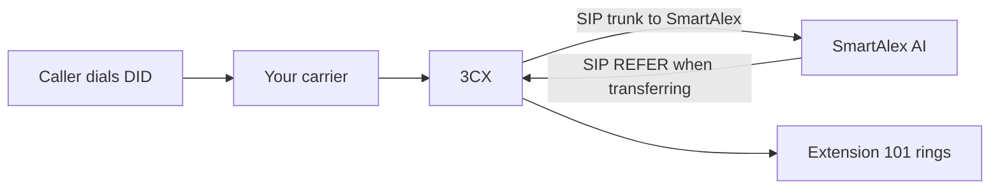

<Info>
**Audience**: 3CX administrator. **Time**: 10 minutes end to end. **3CX version**: v18 or later (v20 recommended).
</Info>

## Prerequisites

Before you begin, have these in hand:

- 3CX edition: **StartUP Pro** or higher. SMB Free restricts SIP trunks to an approved list , we're not on that list, so Free won't work.
- 3CX admin console login
- Your 3CX's **PBX SIP domain** , the FQDN your extensions would use (e.g., `pbx.acmecorp.co.za` for on-premise, or `acmecorp.3cx.cloud` for hosted)
- List of extensions you want the AI to be able to transfer to (numbers + names + departments)
- A DID (phone number) that the AI will answer on , either existing on your carrier, or newly provisioned
- A SmartAlex workspace with an agent already configured and wallet credit available

## Overview of the flow



## Step 1 , Create the SIP trunk in SmartAlex

<Steps>
  <Step title="Open Phone Numbers">
    In the SmartAlex dashboard, navigate to **Phone Numbers**.
  </Step>
  <Step title="Connect Your Carrier">
    Click **Connect Your Carrier** in the top right.
  </Step>
  <Step title="Choose SIP Trunk">
    On the carrier screen, select **SIP Trunk , Connect your PBX**.
  </Step>
  <Step title="Select 3CX">
    On the "What PBX are you using?" screen, pick **3CX , Cloud or on-premise PBX** from the dropdown. This pre-fills 3CX-appropriate defaults (UDP transport, G.711 codecs, digest auth).
  </Step>
  <Step title="Fill the form">
    - **Trunk Name**: `Acme HQ 3CX` (or whatever labels the trunk for you)
    - **PBX SIP Domain**: your 3CX's hostname or IP, e.g., `pbx.acmecorp.co.za` , this is required because it's what the AI uses to address transfers back to your PBX
    - **Authentication Method**: leave on **Credentials** unless you have a specific IP-allowlist requirement
    - **SIP Username + SIP Password**: leave blank to auto-generate (recommended)

    Open **Advanced Settings** only if you need to change defaults. The defaults for 3CX are correct for 99% of setups.
  </Step>
  <Step title="Create SIP Trunk">
    Click the button. Trunk is created on the SmartAlex SIP infrastructure in under 5 seconds.
  </Step>
</Steps>

After creation, the success screen shows a connection-details panel. **Leave this tab open** , you'll copy values from here to 3CX.

## Step 2 , Add the trunk in 3CX

<Steps>
  <Step title="Log in to 3CX admin console">
    Typically at `https://your-pbx.3cx.cloud:5001` or your on-premise 3CX admin URL.
  </Step>
  <Step title="Navigate to SIP Trunks">
    Left sidebar → **SIP Trunks** → **Add SIP Trunk**.
  </Step>
  <Step title="Choose Generic Provider">
    - Country: **Generic**
    - Provider: **Generic VoIP Provider** (or **Generic SIP Trunk**, depending on your 3CX version)
    - Main Trunk No.: leave blank (we'll set DID routing later)

    Click **OK**.
  </Step>
  <Step title="Fill General tab">
    - **Enter name of Provider**: `SmartAlex`
    - **Registrar/Server**: `sip.voice.getsmartalex.com`
    - **Outbound Proxy**: `sip.voice.getsmartalex.com`
    - **Number of SIM Calls**: set to the concurrent-call limit you configured in SmartAlex (default 10)
    - **Type of Authentication**: **Register/Account based**
    - **Authentication ID**: paste the username from SmartAlex
    - **Authentication Password**: paste the password from SmartAlex
    - **3CX requires Registration**: Yes
  </Step>
  <Step title="Fill DIDs tab">
    Add the DID(s) you want the AI to answer on. Format: E.164 without the plus sign (e.g., `27872500100`). These are the numbers inbound calls will hit to reach the AI.

    Click the save icon next to each number or press Enter after typing.
  </Step>
  <Step title="Codec Priority">
    Under the **Options** or **Codec Priority** tab, set:

    1. **G.711 A-law (PCMA)** , for South African calls
    2. **G.711 u-law (PCMU)** , for US / UK / international

    If G.722 is listed, leave it enabled at position 3 , it's HD voice when the carrier supports it.
  </Step>
  <Step title="Save and verify registration">
    Click **OK** / **Save**.

    Return to **SIP Trunks** list , within 30 seconds the status indicator should turn green / show **Registered**. If it doesn't, see Troubleshooting below.
  </Step>
</Steps>

## Step 3 , Route inbound calls to SmartAlex

You have two options. Pick the one that matches your scenario:

### Option A , AI answers on your existing DIDs

Your customer-facing numbers stay with your carrier. 3CX receives inbound calls and routes selected DIDs to SmartAlex instead of to an extension or queue.

<Steps>
  <Step title="Create Inbound Rule in 3CX">
    **Inbound Rules** → **Add Inbound Rule**.

    - **DID/DDI Number**: the DID you want the AI to answer
    - **Office Hours Action**: **External Number** (or **Route to a specific trunk**)
    - **External Number / Trunk**: select the SmartAlex trunk
    - **After Hours Action**: same (for 24/7 coverage) or your previous routing if you only want AI during business hours
  </Step>
  <Step title="Save and test">
    Save the rule. Call the DID from another line. You should hear the AI answer.
  </Step>
</Steps>

### Option B , AI answers on a SmartAlex DID, transfers into 3CX on demand

Your customer-facing number is provisioned through SmartAlex. The AI always answers, and transfers into 3CX extensions only when needed.

<Steps>
  <Step title="Provision a number in SmartAlex">
    In **Phone Numbers**, click **Buy Number** or **Import Your Number**. Pick the country and area code. Assign to an agent.
  </Step>
  <Step title="Publish this number as your customer-facing line">
    Print it on your website, business cards, signage. Don't touch 3CX's inbound rules at all , SmartAlex handles the inbound side independently.
  </Step>
</Steps>

**Option B is cleaner for demos and pilots.** **Option A is better for long-term production** because it keeps your DIDs on your carrier contract.

## Step 4 , Add your extensions in SmartAlex

The AI needs to know which extensions exist and what to call them.

<Steps>
  <Step title="Navigate to PBX Settings">
    In SmartAlex: **Settings** → **PBX**. You'll see your newly-created trunk listed.
  </Step>
  <Step title="Add extensions one at a time or via CSV">
    For each extension, capture:
    - **Ext**: 2 to 6 digits (e.g., `101`)
    - **Name**: what appears in call records and what the AI speaks (e.g., `Sales`)
    - **Owner**: person on that extension (e.g., `Sarah Jones`) , optional
    - **Department**: grouping tag (e.g., `Sales`) , optional

    For aliases (words the caller might use to describe who they want), use the CSV import. Format:

    ```
    extension,display_name,owner,department,aliases
    101,Sales,Sarah Jones,Sales,sarah|sales team|sarah jones
    102,Support,John Smith,Support,support|help|tech
    103,Billing,Tshidi Mokoena,Accounts,billing|accounts|invoices
    ```

    Aliases are pipe-separated. Max 500 rows per CSV import.
  </Step>
  <Step title="Verify the list renders">
    The directory should show all your extensions with their metadata.
  </Step>
</Steps>

## Step 5 , Link the agent to the SIP trunk

<Note>
This step writes `agents.sip_trunk_id` , the link that tells the AI about your PBX extensions.
</Note>

In **Agent Studio** → your agent → **Telephony** tab:

- **PBX SIP Trunk**: pick the trunk you just created from the dropdown

Save the agent. On the next call, the AI will have the full extension directory loaded and `transfer_to_pbx` available as a tool.

## Step 6 , Test the transfer

<Steps>
  <Step title="Call the DID">
    From a mobile or another phone, dial the DID you assigned to the agent.
  </Step>
  <Step title="Wait for the AI greeting">
    The AI should answer within 1–2 seconds.
  </Step>
  <Step title="Ask for a transfer">
    Say: **"Can you put me through to Sales?"**
  </Step>
  <Step title="Verify the AI's response">
    It should respond with something like *"Transferring you to Sales now."*
  </Step>
  <Step title="Verify the extension rings">
    Within 3 seconds, extension 101 on 3CX should ring. Answer. You're connected.
  </Step>
</Steps>

## Validation checklist

- [ ] SmartAlex trunk status is **Active**
- [ ] 3CX trunk status is **Registered** (green)
- [ ] DID is in the **DIDs** tab of the 3CX trunk
- [ ] Inbound Rule routes the DID to the SmartAlex trunk (if using Option A)
- [ ] Extensions are populated in SmartAlex PBX Settings
- [ ] Agent is linked to the SIP trunk via Agent Studio → Telephony tab
- [ ] A test call reaches the AI
- [ ] A test transfer rings the correct extension
- [ ] CDR in 3CX shows the call, the trunk, and the transfer event

## Rollback procedure

If something goes wrong and you need to revert to your previous routing:

1. **In 3CX**: edit the Inbound Rule back to its previous target (e.g., your old IVR or Reception extension). The trunk can remain registered , it just won't receive any calls.
2. **In SmartAlex**: no action needed , the trunk stays configured but inactive. You can return to it anytime.

Total rollback time: 30 seconds.

## 3CX-specific notes and quirks

<AccordionGroup>
  <Accordion title="Attended transfers of external calls">
    If your 3CX users later attended-transfer a call that came via SmartAlex, some 3CX versions require **SIP ID = extension number** to be set in the extension's **Other** tab. This is a 3CX configuration concern, not a SmartAlex one.
  </Accordion>
  <Accordion title='"Supports Re-Invites" / "Supports Replaces" settings'>
    Leave these at the defaults 3CX sets for Generic SIP trunks. SmartAlex handles both correctly.
  </Accordion>
  <Accordion title="3CX Cloud vs on-premise">
    Setup is identical. On-premise installs need firewall rules allowing outbound UDP 5060 (or TCP 5060 / TLS 5061) to `sip.voice.getsmartalex.com`. 3CX Cloud already has outbound network access.
  </Accordion>
  <Accordion title="3CX v18 vs v19 vs v20">
    Menu paths are almost identical across versions. The only noticeable difference is in where **Inbound Rules** live (slightly different sidebar position in each version).
  </Accordion>
  <Accordion title="Hosted 3CX Pro vs Enterprise">
    Both work. Enterprise-tier licence limits don't affect SIP trunking to SmartAlex.
  </Accordion>
</AccordionGroup>

## Common errors

<AccordionGroup>
  <Accordion title="3CX trunk shows 'Not Registered' or red indicator">
    80% of the time this is one of:
    - Username or password typed incorrectly , copy/paste again from SmartAlex
    - 3CX behind NAT with SIP ALG enabled on the firewall , **disable SIP ALG** on the firewall
    - Outbound UDP 5060 blocked by firewall , check firewall rules

    Verify with `Activity Log` in 3CX (**Admin** → **System** → **Event Log** or **Activity Log**). Look for 401/403 responses (credentials) or timeouts (network).
  </Accordion>
  <Accordion title="Inbound calls ring but the AI doesn't answer">
    The DID is likely not added to the SmartAlex trunk's accepted numbers list. In 3CX, check the trunk's **DIDs** tab includes the number being dialled. In SmartAlex, the DID must be on the LiveKit inbound trunk (provisioned automatically by Support if you're on Option A with non-SmartAlex DIDs).
  </Accordion>
  <Accordion title="Transfer fires but 3CX returns 603 Decline">
    The target extension doesn't exist in 3CX. Verify in 3CX **Extensions** that the extension number the AI is trying to reach is active. Cross-check the extension list in SmartAlex matches what's actually provisioned in 3CX.
  </Accordion>
  <Accordion title="One-way audio (you can hear them, they can't hear you)">
    Almost always SIP ALG or NAT. Disable SIP ALG on the firewall between 3CX and the internet. If on-premise behind a symmetric NAT, configure 3CX's external IP and STUN settings under **Network**.
  </Accordion>
  <Accordion title="Call drops after ~30 seconds">
    Your firewall is timing out the UDP session. Increase SIP session timeout on the firewall to at least 1800 seconds.
  </Accordion>
</AccordionGroup>

## Next steps

<CardGroup cols={3}>
  <Card title="Call Routing & Transfers" icon="arrow-right-arrow-left" href="/telephony/call-routing-transfers">
    Cold vs warm vs attended , what we support.
  </Card>
  <Card title="Testing & Validation" icon="check-double" href="/telephony/testing-validation">
    Full end-to-end test procedure.
  </Card>
  <Card title="Troubleshooting" icon="wrench" href="/telephony/troubleshooting">
    Every SIP error code, every fix.
  </Card>
</CardGroup>

