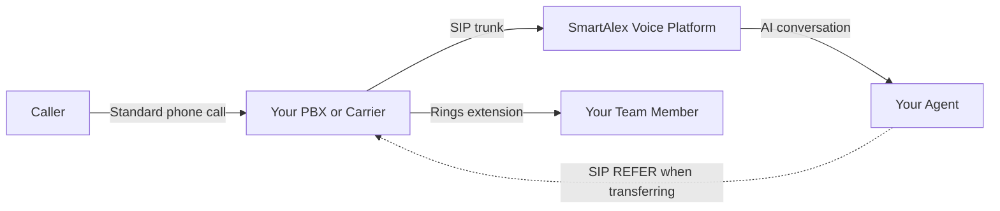
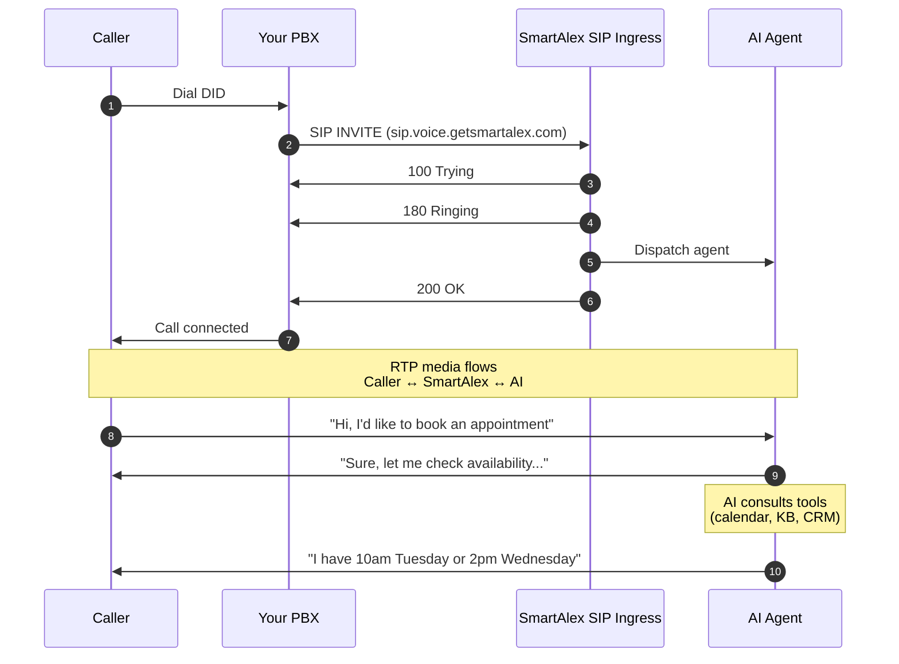
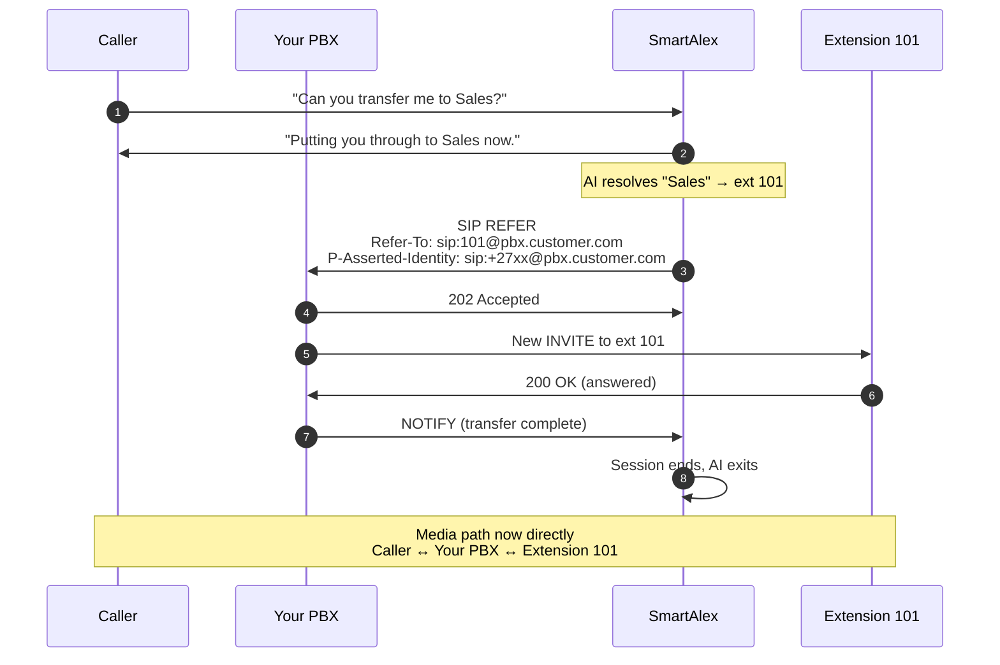
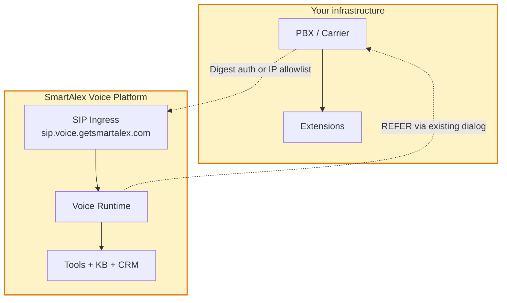

<Info>
**Audience**: CTO, network engineer, voice engineer. This page is the technical truth.
</Info>

## The three participants

Every integration involves exactly three parties:

1. **Caller** , on any phone, anywhere
2. **Customer's phone system** , the PBX or carrier the customer already owns
3. **SmartAlex Voice Platform** , the AI runtime, media routing, and SIP infrastructure



Once the AI has transferred the caller, SmartAlex is completely out of the media path. The caller and your team member are connected directly through your own PBX.

## Inbound call flow

The sequence when a caller dials a DID that routes to SmartAlex:



## Transfer flow , SIP REFER

When the caller asks to be connected to a person or department, the AI issues a standard SIP REFER:



**Key properties of this flow:**

- The REFER travels on the **existing SIP dialog** , no new outbound trunk needed from our side
- Your PBX handles the new INVITE using its own rules: ring groups, queues, busy-forward, no-answer-forward, all of it
- The original caller's number is preserved via the `P-Asserted-Identity` header (RFC 3325)
- Once the transfer is accepted, SmartAlex is no longer in the media path

## Trust boundaries



- **Customer-side credentials** (your SIP auth, your PBX admin password) never leave your infrastructure.
- **SmartAlex-side credentials** (the username and password we issue you for the SIP trunk) are stored encrypted in our secrets vault. Never logged, never visible to support staff.
- All SIP signalling can be encrypted end-to-end using TLS (port 5061). Media can be encrypted using SRTP.

## Authentication model

Two supported methods , you pick one or use both.

| Method | How it works | When to use |
|---|---|---|
| **Digest credentials** | We issue a username and 24-character password. Your PBX registers or sends INVITEs with those credentials. | Most common. Works for any PBX with a public-facing SIP client. No need for static IP. |
| **IP allowlist** | Your PBX's public IP is added to the trunk's allowed source list. No credentials needed. | When your PBX has a static public IP and you want the simplest possible auth. Common with on-premise enterprise PBXes. |
| **Both** | Digest + IP allowlist. INVITEs must pass both checks. | Enterprise security postures that require defence in depth. |

## Where audio actually flows

**Before transfer:**
```
Caller <-RTP-> Your PBX <-RTP-> SmartAlex SIP Ingress <-RTP-> AI Voice Runtime
```

**After transfer:**
```
Caller <-RTP-> Your PBX <-RTP-> Extension 101
```

SmartAlex's media path ends at the moment the REFER is accepted. We're not a man-in-the-middle on the human-to-human conversation.

## Failure modes and fallbacks

| Failure | What happens | What the caller experiences |
|---|---|---|
| REFER timeout (30 seconds with no response from PBX) | Fallback speech triggered | *"I wasn't able to connect you to Sarah. Can I take a message instead?"* |
| Extension unknown to AI | Tool raises validation error | AI asks clarifying question, offers alternatives |
| PBX unreachable entirely | Fall back to `call_forwarding_number` if configured, else take message | *"I can't reach our team right now. What's the best number to call you back on?"* |
| AI silent or confused | Caller can hang up; call records flagged for review | Standard disconnect |

## Codecs and media

| Setting | Default | Configurable |
|---|---|---|
| Codecs | G.711 u-law (PCMU) first, G.711 A-law (PCMA), G.722 HD | Per trunk |
| DTMF | RFC 2833 (telephony-event) | Not configurable , standard |
| Jitter buffer | Adaptive, 20–200 ms | No |
| Packet loss concealment | Enabled | No |
| Noise suppression | Optional Krisp AI noise cancellation on ingress | Per trunk |
| MOS target | > 4.0 in normal network conditions | Network dependent |

## Concurrency model

Three layers cap concurrent calls:

1. **Per trunk** , configurable, default 10, maximum 1000
2. **Per tenant** , set on your account, typically matches your plan
3. **Global platform** , scales with infrastructure and is always higher than any single tenant needs

When a limit is reached, new SIP INVITEs receive `503 Service Unavailable` with a `Retry-After` header.

## Regional routing

SmartAlex SIP ingress is geographically distributed. INVITEs are routed to the nearest region automatically based on your PBX's public IP, keeping audio latency low.

For South African customers, calls are typically routed via European ingress (60–80 ms one-way typical). Dedicated SA regional ingress is on the roadmap.

## Next steps

<CardGroup cols={3}>
  <Card title="Security & Compliance" icon="shield-check" href="/telephony/security-compliance">
    Encryption, retention, POPIA, GDPR.
  </Card>
  <Card title="Network Requirements" icon="network-wired" href="/telephony/network-requirements">
    Firewall rules, ports, NAT.
  </Card>
  <Card title="Call Routing & Transfers" icon="arrow-right-arrow-left" href="/telephony/call-routing-transfers">
    Cold, warm, attended , what we support.
  </Card>
</CardGroup>

