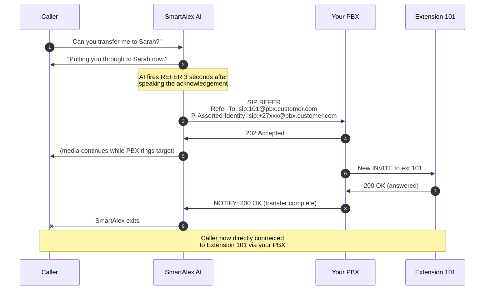

<Info>
This is the page most CTOs evaluating a voice AI platform spend the longest on. It's the technical truth about what happens when the AI hands a call off.
</Info>

## The four kinds of transfer

Telephony vendors use "transfer" to mean at least four different things. Here's the precise vocabulary, what SmartAlex does today, and what's on the roadmap.

| Transfer type | What it means | Do we support it? |
|---|---|---|
| **Cold / blind / unattended** | The AI says "connecting you", issues a SIP REFER, and drops out. The caller lands on the target cold. | **Yes , default today.** |
| **Warm / attended / consultative** | The AI puts the caller on hold, calls the target privately, briefs them, then bridges the caller in. | **Yes , for named targets** via the warm transfer system. |
| **Semi-attended** | Dial the target, wait for ring, complete the transfer before the target answers. | Not directly supported. |
| **Transfer with REPLACES** | SIP-level mechanism where an existing dialog is replaced by a new one, used in call-parking scenarios. | Handled transparently , not a user-facing feature. |

## Cold (blind) transfer , the default

When the AI calls `transfer_to_pbx` with a destination that resolves to a PBX extension, or `transfer_call` with a PSTN number, a standard SIP REFER is sent on the existing call dialog.

**Key properties:**

- REFER travels on the **existing dialog** , no new outbound trunk needed on our side
- Your PBX applies its own routing rules after receiving the REFER , queue, ring group, busy-forward, no-answer-forward
- The original caller's phone number is preserved via `P-Asserted-Identity` (RFC 3325)
- Once the transfer is accepted, SmartAlex is no longer in the media path

## Warm transfer , named targets

For named people (as opposed to extensions), SmartAlex supports warm transfer where the AI briefs the target before bridging in the caller.

<Steps>
  <Step title="AI speaks a filler line to the caller">
    *"Let me grab Craig for you."*
  </Step>
  <Step title="Target is dialled in the background">
    While the caller waits, the target's number rings. Call screening is applied based on their number.
  </Step>
  <Step title="When the target answers, a briefing is spoken">
    *"Hi Craig, I have a caller on the line about a service appointment for an X5. Putting you through now."*
  </Step>
  <Step title="Caller and target are bridged">
    The AI exits the call.
  </Step>
</Steps>

Warm targets are configured on the agent as "transfer destinations" , name, aliases, phone number, optional briefing template.

## Transfer targets , what the AI can send a caller to

| Target type | How it's configured | SIP URI format |
|---|---|---|
| **PBX extension** | `PbxExtensionsManager` → extension number + name + aliases | `sip:<ext>@<pbx_domain>` |
| **PBX queue** | Added as an extension with the queue's number | `sip:<queue>@<pbx_domain>` |
| **PBX ring group** | Added as an extension with the ring group's number | `sip:<ring>@<pbx_domain>` |
| **Individual PSTN number** | Configured as a "transfer target" on the agent with name, alias, phone | `tel:+27xxxxxxxxx` |
| **Default call-forwarding number** | Agent setting , single external number | `tel:+27xxxxxxxxx` |
| **Voicemail** | Falls through automatically if extension no-answer-forwards to VM | PBX-managed |

## Caller ID forwarding

When SmartAlex transfers a call, it forwards the original caller's phone number to your PBX via the `P-Asserted-Identity` SIP header (RFC 3325). Your PBX reads this and displays the real caller ID on the target extension's phone , not the SmartAlex trunk's number.

**What the receiving extension sees:** the original caller's ANI (A-number).

**What gets logged in your CDR:** original caller's number as the calling party, routed through the SmartAlex trunk.

## How transfers appear in your PBX's CDRs

Your PBX logs transfers as **two legs**:

1. **Leg 1**: inbound call from SmartAlex trunk , duration equals time the AI was on the call
2. **Leg 2**: transferred call to the extension , duration equals time spent with the human

Both legs are linked in most PBX CDR exports. Reporting, recording (if your PBX records transferred calls), and quality monitoring continue to work normally.

## Failure modes

<AccordionGroup>
  <Accordion title="Target doesn't answer">
    Whatever your PBX does normally , ring-through to another extension, voicemail, queue fallback , continues to apply. SmartAlex has already dropped out; we don't re-take control.
  </Accordion>
  <Accordion title="Target returns SIP 486 Busy Here">
    PBX handles this per its own rules (often ring-group fallback or voicemail). SmartAlex is out.
  </Accordion>
  <Accordion title="Target returns SIP 603 Decline">
    Usually means the extension doesn't exist or is disabled. The REFER completes anyway (from SmartAlex's perspective), but the caller ends up wherever your PBX sends declined calls.
  </Accordion>
  <Accordion title="PBX unreachable when REFER is attempted">
    30-second timeout. If no response, the AI speaks the fallback: *"I wasn't able to connect you. Can I take a message instead?"* The caller remains on the line with the AI.
  </Accordion>
  <Accordion title="PBX is available but mishandles the REFER">
    Most commonly a SIP-header compatibility issue. Enable detailed SIP logging on your PBX, capture the REFER and the response, and contact support.
  </Accordion>
</AccordionGroup>

## Latency

| Phase | Typical |
|---|---|
| AI speaks acknowledgement ("Transferring you now") | 0–2 seconds |
| Scheduled delay before firing REFER | 3 seconds |
| REFER → PBX accepts → new INVITE → extension rings | 0.5–2 seconds |
| Target picks up | Human-dependent |

Total time from the AI's acknowledgement to the target's phone ringing: **3–5 seconds**.

## What we don't do today

<Warning>
Be direct about these in customer conversations. Over-promising is worse than acknowledging the gap.
</Warning>

1. **Semi-attended transfer** (complete transfer before target answers) , not supported. Uncommon request.
2. **Real-time transfer fallback chaining** , if extension 101 doesn't answer and we wanted to fall through to ext 102 by *our* rules. Today, this is handled by your PBX's fallback rules instead.
3. **Cross-platform transfer** , e.g., PBX extension to a Microsoft Teams user. Works if your Teams deployment has an SBC exposing Teams numbers as SIP targets; otherwise not directly supported.
4. **Transfer to WebRTC endpoints** , for bespoke "transfer to a web agent" cases, custom integration work is needed.

## Configuration summary , what drives what

| Thing you want | Where you configure it |
|---|---|
| AI can transfer to an extension | `Settings → PBX → [trunk] → Extensions` |
| AI can transfer to a PSTN number by name | Agent Studio → Transfer Targets |
| Default fallback number if AI can't help | Agent Studio → Call Forwarding Number |
| Transfer rules (when to hand off) | Agent Studio → system prompt / custom instructions |
| Caller ID shown on transferred call | Automatic via P-Asserted-Identity |

## Next steps

<CardGroup cols={3}>
  <Card title="Testing & Validation" icon="check-double" href="/telephony/testing-validation">
    End-to-end test procedures.
  </Card>
  <Card title="Troubleshooting" icon="wrench" href="/telephony/troubleshooting">
    Every SIP error and fix.
  </Card>
  <Card title="Observability" icon="chart-line" href="/telephony/observability">
    Monitor transfer success rates.
  </Card>
</CardGroup>
