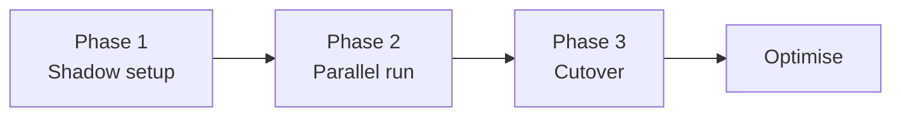

<Info>
This page is written for the person responsible for the rollout: IT lead, operations manager, or technology partner. Read it before you touch production.
</Info>

## The three-phase rollout

Most successful SmartAlex deployments follow the same pattern:

Skipping phases usually costs more time than running them properly does.

## Phase 1 , Shadow setup (days 1–3)

**Goal**: everything configured on both sides, but no production calls are using it yet.

**Activities:**

- Provision the SIP trunk in SmartAlex
- Configure the trunk on your PBX, verify it registers
- Add all extensions
- Build and tune the AI agent in Agent Studio with your system prompt, voice, and tools
- Link the agent to the SIP trunk
- Acquire a **test DID** , either a new number from SmartAlex or a low-traffic existing DID you can redirect safely
- Route the test DID to the AI and run internal test calls from the team

**Exit criteria:**

- Trunk registered both sides
- Internal team can call the test DID, AI answers, transfers work
- No SIP errors in the PBX log for the trunk
- At least 10 successful test calls across different intents (booking, transfer, enquiry)

## Phase 2 , Parallel run (days 4–14)

**Goal**: real customer traffic goes through SmartAlex on a subset of calls, while the rest continues on your existing setup.

**Three common models for parallel run:**

### Model A , after-hours only

The AI handles all calls outside business hours. Your existing setup continues to handle business hours.

- **Pros**: zero risk to daytime operations, fast to set up
- **Cons**: limited learnings (after-hours callers have different intents)
- **Setup**: in your PBX, inbound rule routes to SmartAlex trunk only during **After Hours Action**. Business hours continue unchanged.

### Model B , overflow

The AI picks up only when all your human lines are busy or no-one answers within N rings.

- **Pros**: catches dropped calls that would otherwise be lost
- **Cons**: AI only handles the overflow, less usage data
- **Setup**: configure ring groups / queues to forward unanswered calls to the SmartAlex trunk after timeout

### Model C , single DID test

Pick one low-traffic DID (e.g., a department line) and route it entirely to SmartAlex. Leave main DIDs on your existing setup.

- **Pros**: full AI experience on real traffic, limited blast radius
- **Cons**: not all intents represented , the chosen department's caller profile is over-sampled
- **Setup**: route just that DID to the SmartAlex trunk, leave other DIDs alone

**Exit criteria from Phase 2:**

- At least 50 real customer calls handled by the AI across different times of day
- Transfer accuracy above 90% (AI transfers to the correct target)
- Call completion rate above industry norm for your type of business
- No complaints attributable to the AI specifically
- Your team is comfortable with the AI's voice, tone, and behaviour

## Phase 3 , Cutover (day 15+)

**Goal**: main DIDs route to SmartAlex in front of your existing setup.

**Sequence:**

<Steps>
  <Step title="Schedule the cutover window">
    Pick a low-traffic hour (early morning typically) on a day you can actively monitor.
  </Step>
  <Step title="Announce internally">
    Tell the team the cutover is happening. Have the rollback procedure printed and on the desk.
  </Step>
  <Step title="Update inbound rules">
    In your PBX, change the main DID's inbound rule to route to the SmartAlex trunk.
  </Step>
  <Step title="Make a test call immediately">
    From a mobile, call the main DID. Confirm the AI answers.
  </Step>
  <Step title="Monitor for 2 hours">
    Watch your PBX CDR and SmartAlex call logs. Check for anomalies: abnormal call lengths, transfer failures, callers hanging up immediately.
  </Step>
  <Step title="Optimise over the following days">
    Based on real call transcripts and user feedback, refine the system prompt, add missing extensions, improve aliases, tune the voice.
  </Step>
</Steps>

## Rollback procedure

If anything goes wrong during cutover or after:

<Steps>
  <Step title="Revert the inbound rule in your PBX">
    Change the DID's inbound route back to its previous target (IVR, reception extension, queue). Effect: immediate.
  </Step>
  <Step title="Notify your team">
    Let reception and the phone-handling team know they're back on the old system.
  </Step>
  <Step title="Investigate without pressure">
    With traffic safely back on the old setup, you can dig into what went wrong , review call logs, check SIP traces, contact support.
  </Step>
</Steps>

**Rollback time**: 30 seconds from deciding to revert to first call hitting the old system.

## What to measure

Track these metrics through all three phases:

| Metric | Target (production) |
|---|---|
| AI answer rate | 98%+ |
| Average call duration | Reasonable for your business , too short suggests callers are hanging up; too long suggests the AI isn't resolving |
| Transfer success rate | 90%+ |
| Transfer to correct target (no mis-routes) | 95%+ |
| Calls fully resolved by AI (no transfer) | 40–60% typical, higher for transactional businesses |
| Caller hangups in first 15 seconds | <5% (above this usually indicates greeting or voice issues) |
| Post-call survey / NPS (if captured) | Baseline from before SmartAlex, then track deltas |

## Iteration cadence

After Phase 3, optimise weekly for the first month:

- Review the 10 worst calls (by duration, by hang-up, by flagged sentiment)
- Listen to the transcripts
- Identify patterns , phrasing the AI gets wrong, extensions it can't find, intents it doesn't understand
- Update the system prompt, add aliases, add missing extensions
- Re-test the affected intents

## Common pitfalls

<AccordionGroup>
  <Accordion title="Trying to replace everything at once">
    The most common failure mode. Don't route all traffic on day one. Always have a subset for 7–14 days first.
  </Accordion>
  <Accordion title="Not telling the team in advance">
    Reception staff will be confused (and unhelpful) if customers start mentioning "the AI that answered" and no-one warned them. Communicate internally before external.
  </Accordion>
  <Accordion title="Over-scripting the first message">
    A long formal greeting feels corporate and callers tune out. "Hi, how can I help?" outperforms "Thank you for calling Acme Medical Centre, a subsidiary of..."
  </Accordion>
  <Accordion title="Not adding aliases for extensions">
    Callers say "can I speak to Sarah in sales" or "connect me to tech support" , not "extension 101". Aliases are the difference between 70% and 95% transfer accuracy.
  </Accordion>
  <Accordion title="Leaving the system prompt generic">
    An AI that says "I'm an AI assistant and I can help with your enquiry" is not great. One that says "I book service appointments, handle billing questions, and transfer clinical queries to our on-duty nurse" is much better. Specificity in the system prompt directly drives accuracy.
  </Accordion>
</AccordionGroup>

## Next steps

<CardGroup cols={2}>
  <Card title="Testing & Validation" icon="check-double" href="/telephony/testing-validation">
    Pre-cutover test checklist.
  </Card>
  <Card title="Observability" icon="chart-line" href="/telephony/observability">
    Metrics to track post-cutover.
  </Card>
</CardGroup>

