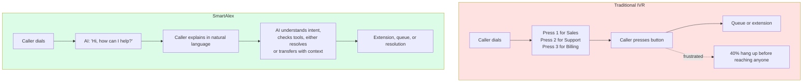
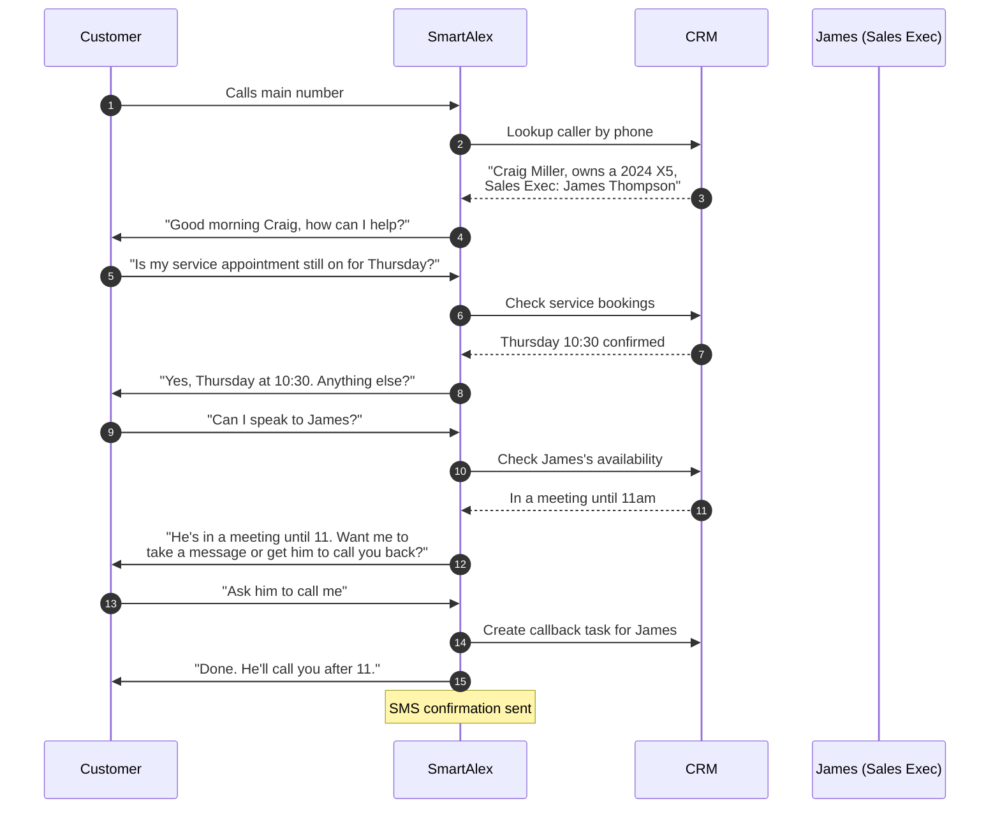

<Note>
Most customers arrive with one of two setups: a traditional DTMF IVR ("press 1 for sales, 2 for support") or a live receptionist who answers and routes calls. SmartAlex replaces either , or both.
</Note>

## The problem with traditional IVRs

A DTMF IVR forces the caller to navigate your company's org chart using the numeric keypad. It's cheap, it's always been there, and it's universally disliked.

| Metric | Industry average |
|---|---|
| Abandonment rate | 30–40% |
| Misrouting rate | 15–25% |
| Callers who press "0 for operator" to bypass the menu | ~45% |
| Average handle time inflation vs. direct routing | 60–90 seconds |

These numbers don't improve with a longer menu tree. They get worse.

## The problem with a live receptionist

A human receptionist handles nuance beautifully. They also:

- Cost between R20,000 and R40,000 per month in South Africa (R240k–R480k/year loaded)
- Cover only business hours (or you pay for out-of-hours)
- Take lunch, sick days, and leave
- Miss calls during peak times
- Can only take one call at a time
- Need training to know every team member and their specialty
- Struggle to remember every repeat caller

A great receptionist is a genuine competitive advantage. Most businesses cannot afford a great one around the clock.

## What SmartAlex does differently

Instead of a DTMF tree, the AI has a conversation. Instead of a human's memory, it has access to your CRM, knowledge base, calendar, and any tools you expose. It works 24/7, handles every call simultaneously, and remembers every caller.



## A real example , medical practice

A multi-practitioner medical clinic. 200 inbound calls per day. Previous IVR:

```
Welcome to Acme Medical.
  Press 1 for appointments
  Press 2 for billing
  Press 3 for Cardiology
  Press 4 for Pediatrics
  Press 0 for reception
```

**Before SmartAlex:**
- 40% of callers hung up before finishing the menu
- 25% pressed the wrong option and had to be re-routed
- Reception handled ~200 calls/day during business hours only
- No after-hours coverage
- 3-minute average call handle time (menu + wait + human)

**After SmartAlex (measured over 60 days):**
- Abandonment: **8%**
- Misrouting: **3%**
- Reception handles **80 calls/day** (AI resolved the other 60%, transferred the remaining 40% with full context)
- 24/7 coverage , 38 after-hours calls per week captured that would previously have gone to voicemail
- 45-second average handle time
- Patient satisfaction (post-call NPS) rose from 6.2 to 8.4

The AI handled standard appointment bookings, prescription refill requests, and general enquiries without ever transferring to a human. Clinical questions were transferred to the on-duty nurse with the reason for the call already summarised in the CRM note.

## A real example , BMW dealership (receptionist replacement)

This is a different pattern. The customer doesn't have a DTMF IVR , they have a receptionist who knows every customer by name and routes calls to their assigned Sales Executive or Service Advisor.

SmartAlex replicates this concierge model:



The AI recognised the caller, answered a substantive service question directly, and when the caller asked for a specific person, it didn't blindly transfer , it checked availability and managed the handoff intelligently.

## How the replacement is configured

Three configuration decisions map your existing setup to SmartAlex:

### 1. What replaces the IVR menu?

Instead of a menu, you give the AI a **first message** and a **system prompt** that describes who to help with what. The AI uses natural conversation to understand intent.

Example first message for a medical practice:
> "Good morning, Acme Medical. How can I help you today?"

### 2. What replaces the routing targets?

Your **PBX extension directory**. You tell SmartAlex what extensions exist, who's on each, and what aliases callers might use ("sales team", "support", "John", "John Smith").

Example directory:
| Extension | Display name | Owner | Aliases |
|---|---|---|---|
| 101 | Reception | , | reception, front desk |
| 102 | Sales | Sarah Jones | sarah, sales, sarah jones, sales team |
| 103 | Support | John Smith | support, tech, john, help |
| 104 | Billing | , | billing, accounts, invoices |

When a caller says "put me through to Sarah in sales", the AI matches "Sarah" against the alias list, resolves to extension 102, and issues a SIP REFER.

### 3. What replaces the receptionist's judgement?

Your **system prompt** plus **tools**. The prompt describes how to handle common requests. Tools give the AI access to calendar, CRM, knowledge base, SMS, and anything else you expose.

Example system prompt fragment:
> "For service appointments, always check the calendar first. For billing questions, transfer to Extension 104. For urgent clinical questions after hours, transfer to the on-call mobile number. Never offer medical advice , always transfer clinical questions to a qualified practitioner."

## What callers notice

- The AI answers in one or two rings
- It has your company's name and an appropriate greeting
- It understands natural language , no keypad required
- It handles common questions directly
- Transfers are fast and land on the right person the first time
- Recent callers are recognised by phone number when their contact exists in your CRM

## What callers don't notice (but should)

- It's an AI. Callers that ask "am I talking to a robot?" are told the truth. Everyone else is just helped.
- It never says "press 1" , because DTMF trees are the problem we're replacing.
- It doesn't read disclaimers, read back long menus, or apologise for wait times. It just helps.

## Next steps

<CardGroup cols={2}>
  <Card title="Conversation Flow Library" icon="messages" href="/telephony/conversation-flows">
    Six real industry examples with full scripts and configuration recipes.
  </Card>
  <Card title="Migration Playbook" icon="route" href="/telephony/migration-playbook">
    How to roll out, parallel-run, and cut over with zero downtime.
  </Card>
</CardGroup>

